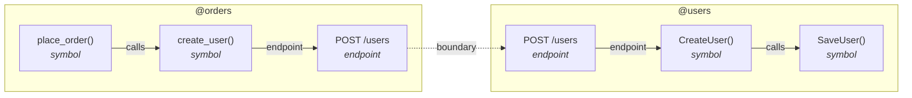

# Cross-service path — a Go server and a Python client

`todo path` runs from a Python function, over the network boundary, into a Go function. The users
service is a Go HTTP server; the orders service calls it from Python.

```
client-py/  (repo: orders)          server-go/  (repo: users)
  client.py   place_order → create_user     server.go     CreateUser → SaveUser
                                            openapi.yaml  POST /users  operationId: createUser
```

There is **one** spec — the users API (`server-go/openapi.yaml`). The consumer does not have its own;
it was built against that same contract, so it ingests it too, under its own repo. And there is **no**
`graph.json` in the tree: `todo symbols` runs graphify on the real source to extract it.

## Run it

Needs [graphify](https://github.com/graphify) on your PATH (for `todo symbols`).

```sh
DB=$(mktemp -u).db

# extract each service's code graph (todo symbols runs graphify on the source)
todo --db "$DB" symbols server-go --repo users
todo --db "$DB" symbols client-py --repo orders

# ingest the one contract — the users API — under both services
todo --db "$DB" endpoints server-go/openapi.yaml --repo users    # the provider
todo --db "$DB" endpoints server-go/openapi.yaml --repo orders   # the consumer, built against it

todo --db "$DB" path orders:place_order users:SaveUser
```

## The path

```
symbol    place_order()  @orders
  ─calls→ symbol    create_user()  @orders
  ─endpoint→ endpoint  POST /users  @orders
  ─boundary→ endpoint  POST /users  @users
  ─endpoint→ symbol    CreateUser()  @users
  ─calls→ symbol    SaveUser()  @users
```

Every node carries its service as `@repo`, so you can see the hop leave `@orders` and arrive in
`@users`: `place_order` and `create_user` are the Python orders service; `CreateUser` and `SaveUser`
are the Go users service; the `boundary` edge between the two `POST /users` endpoints is the network
call.

The API's operationId is `createUser`; the Python client function is `create_user` and the Go handler
is `CreateUser`. `todo endpoints` binds an operationId to a symbol on a **normalized** name — case and
separators dropped — so all three collapse to `createuser` and bind. That is what makes the path cross
languages as well as the network.

## As a Mermaid diagram

`--mermaid` renders the same path as a flowchart. Each service is a subgraph, so the boundary is a box
you cross; the `boundary` edge — the network call — is drawn dotted.

```sh
todo --db "$DB" path orders:place_order users:SaveUser --mermaid
```



`server.go` carries `//go:build ignore` so it stays out of this module's build; graphify parses it all
the same. See [docs/cross-service.md](../../docs/cross-service.md).
